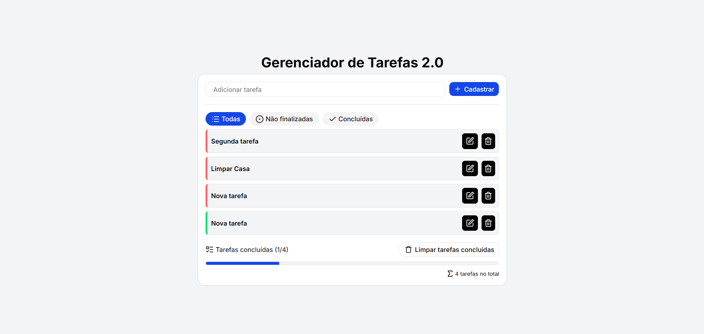

<h1 align="center">✔️ Gerenciador de Tarefas 2.0 ✔️</h1>



---

## ℹ️ Sobre

Este projeto é uma **aplicação web full-stack desenvolvida em Next.js** focada no **gerenciamento prático de tarefas**.

O objetivo principal foi construir uma interface limpa, moderna e responsiva utilizando **Tailwind CSS** e componentes do **shadcn/ui**, aplicando conceitos essenciais de desenvolvimento full-stack com Next.js App Router, Server Actions, integração com ORM (Prisma) e componentização modular.

---

## 📋 Funcionalidades

* **Gerenciamento de Tarefas (CRUD):**
* **Criação:** Adição rápida de novas tarefas a partir do formulário principal.
* **Listagem & Filtros:** Exibição dinâmica com filtros para alternar entre "Todas", "Não finalizadas" e "Concluídas".
* **Atualização:** Edição de título via modal (`EditTask`) e alternância instantânea de status (Pendente/Concluída).
* **Exclusão:** Remoção individual de tarefas ou exclusão em lote de itens concluídos ("Limpar tarefas concluídas").


* **Métricas e Progresso Visuais:**
* **Contadores dinâmicos:** Monitoramento em tempo real do volume total de tarefas e do progresso de conclusão (`X/Y`).
* **Barra de progresso:** Indicador visual de percentual concluído utilizando o componente Progress do shadcn/ui.


* **Interface Responsiva & Acessível:**
* Componentes de UI acessíveis e estilizados com **Tailwind CSS** e **shadcn/ui**.
* Modais de edição e diálogos de confirmação para ações críticas (`alert-dialog`, `dialog`).


---

## 🛠️ Requisitos Técnicos

* **Server Actions:** Mutações de dados (criação, edição, exclusão e alteração de status) executadas diretamente no servidor sem a necessidade de criar rotas de API tradicionais.
* **Persistência de Dados com ORM:** Integração do **Prisma Client** para comunicação tipada e eficiente com o banco de dados.
* **Renderização no Servidor (SSR):** Páginas e layouts estruturados via Next.js App Router para rápido carregamento inicial.
* **Estilização Moderna:** Tailwind CSS com suporte aos primitivos do Radix UI via shadcn/ui.

---

## 🧠 Arquitetura e Padrões Utilizados

* **Server Actions Isoladas (`/src/actions`):**
Toda a regra de negócio e persistência (`create-task.ts`, `delete-task.ts`, `get-tasks.ts`, `toggle-task-status.ts`, `update-task.ts`) fica totalmente isolada da camada visual.
* **Separação entre UI e Componentes de Domínio:**
* `/src/components/ui`: Componentes puros do shadcn/ui (Button, Dialog, Badge, Input, Progress, etc.).
* `/src/components`: Componentes que contêm a regra visual e de interação da aplicação (`TaskList`, `Task`, `EditTask`, `SubmitButton`, `TaskButton`).


* **Camada de Conexão Centralizada (`/src/lib`):**
Instância singleton do Prisma Client (`prisma.ts`) e utilitários auxiliares de estilização (`utils.ts`).

---

## ⚛️ Recursos Utilizados

* **Next.js App Router:** Estrutura baseada na pasta `app/` (`layout.tsx`, `page.tsx`, `globals.css`).
* **"use server":** Diretiva para execução de Server Actions no lado do servidor.
* **shadcn/ui & Radix UI:** Base de componentes acessíveis e estilizados declarativamente.
* **Prisma ORM:** Modelagem de dados e queries tipadas no banco de dados.

---

## 📁 Estrutura de Pastas

```text
src
 ┣ actions
 ┃ ┣ create-task.ts
 ┃ ┣ delete-task.ts
 ┃ ┣ get-tasks.ts
 ┃ ┣ toggle-task-status.ts
 ┃ ┗ update-task.ts
 ┣ app
 ┃ ┣ globals.css
 ┃ ┣ layout.tsx
 ┃ ┗ page.tsx
 ┣ components
 ┃ ┣ ui
 ┃ ┃ ┣ alert-dialog.tsx
 ┃ ┃ ┣ badge.tsx
 ┃ ┃ ┣ button.tsx
 ┃ ┃ ┣ card.tsx
 ┃ ┃ ┣ dialog.tsx
 ┃ ┃ ┣ input.tsx
 ┃ ┃ ┣ progress.tsx
 ┃ ┃ ┗ separator.tsx
 ┃ ┣ EditTask.tsx
 ┃ ┣ SubmitButton.tsx
 ┃ ┣ Task.tsx
 ┃ ┣ TaskButton.tsx
 ┃ ┗ TaskList.tsx
 ┗ lib
 ┃ ┣ prisma.ts
 ┃ ┗ utils.ts

```

---

## 🚀 Tecnologias Utilizadas

* **Next.js** (App Router & Server Actions)
* **React** (Server & Client Components)
* **TypeScript** (Tipagem estática end-to-end)
* **Tailwind CSS** (Estilização utilitária)
* **shadcn/ui** (Sistema de componentes reutilizáveis)
* **Prisma** (ORM para gerenciamento de banco de dados)
* **Lucide React** (Ícones da interface)

---

## 📄 Licença

Este projeto está sob a licença **MIT**.
